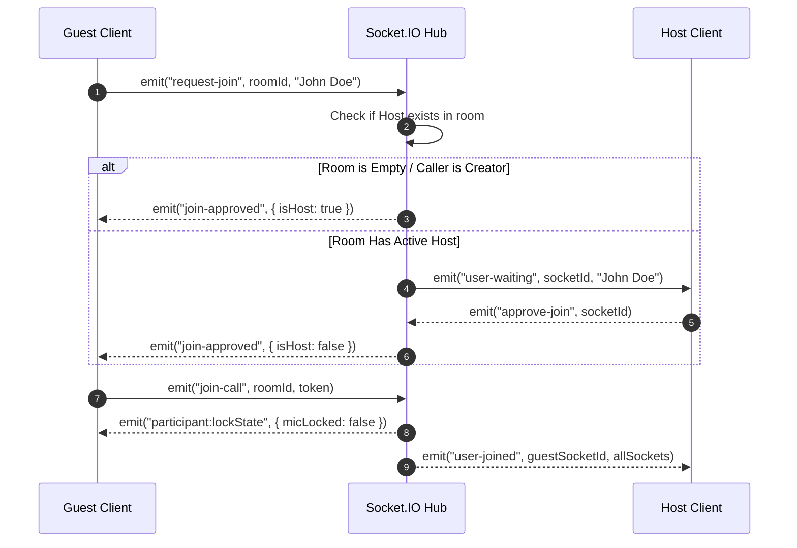

# YORSA — Low-Level Design (LLD)

## 1. Schema Specifications (MongoDB / Mongoose)

### 1.1 Meeting Schema (`models/meeting.model.js`)
```javascript
{
  meetingCode: { type: String, required: true, index: true },
  roomId:      { type: String, index: true },
  hostId:      { type: String, required: true },
  user_id:     { type: String }, // Legacy compatibility
  coHosts:     [{ type: String }],
  title:       { type: String, default: "Yorsa Meeting" },
  date:        { type: Date, default: Date.now },
  expiresAt:   { type: Date },
  micLocked:   { type: Boolean, default: false },
  videoLocked: { type: Boolean, default: false },
  status:      { type: String, enum: ["active", "ended"], default: "active" }
}
```

### 1.2 Transcript Schema (`models/transcript.model.js`)
```javascript
{
  meetingId: { type: String, required: true, index: true },
  chunks: [
    {
      sender:    { type: String, default: "Participant" },
      text:      { type: String, required: true },
      timestamp: { type: Date, default: Date.now },
      duration:  { type: Number, default: 0 }
    }
  ],
  rawText:   { type: String, default: "" },
  createdAt: { type: Date, default: Date.now }
}
```

### 1.3 Meeting Summary Schema (`models/meetingSummary.model.js`)
```javascript
{
  meetingId:   { type: String, required: true, index: true },
  rawText:     { type: String, default: "" },
  summaryText: { type: String, default: "" },
  keyTopics:   [{ type: String }],
  actionItems: [
    {
      task:    { type: String, required: true },
      owner:   { type: String, default: "Unassigned" },
      dueHint: { type: String, default: "TBD" }
    }
  ],
  mindMap: {
    nodes: [
      { id: String, label: String, level: Number, color: String }
    ],
    edges: [
      { from: String, to: String, label: String }
    ]
  },
  notes:        { type: String, default: "" },
  status:       { type: String, enum: ["pending", "completed", "failed"], default: "pending" },
  errorMessage: { type: String },
  createdAt:    { type: Date, default: Date.now },
  updatedAt:    { type: Date }
}
```

---

## 2. Sequence Diagrams

### 2.1 Meeting Join & Gatekeeper Flow


### 2.2 Host Mute-All and Mic Lockdown Flow
```mermaid
sequenceDiagram
    autonumber
    participant Host as Host Client
    participant Server as Socket.IO Hub
    participant Participant as Participant Client

    Host->>Server: emit("host:muteAll", roomId)
    Server->>Server: verifyIsHost(socket, roomId)
    alt Unauthorized Sender
        Server-->>Host: emit("host:error", { message: "Unauthorized" })
    else Verified Host
        Server->>Server: Set participantLocks[roomId][participantId].micLocked = true
        Server->>Participant: emit("participant:forceMute", { locked: true, reason: "Muted by host" })
        Participant->>Participant: audioTrack.enabled = false
        Participant->>Participant: Disable local unmute button (display lock icon)
        Server->>Host: emit("room:participantLocksUpdated", locksMap)
    end
```

### 2.3 Asynchronous AI Summarization & Mind Map Flow

```mermaid
sequenceDiagram
    autonumber
    participant Client as Web Client
    participant Controller as meeting.controller.js
    participant Service as aiService.js
    participant HF as Hugging Face Inference API
    participant DB as MongoDB Atlas

    Client->>Controller: POST /api/meetings/:id/summarize
    Controller->>DB: Set MeetingSummary status = "pending"
    Controller-->>Client: 202 Accepted { status: "pending", meetingId }
    
    rect rgb(20, 20, 20)
        Note over Controller,HF: Asynchronous Worker Job
        Controller->>Service: generateSummaryAndMindMap(rawText, title)
        Service->>HF: POST /models/Qwen/Qwen2.5-7B-Instruct (Strict JSON Prompt)
        alt 503 Model Loading
            HF-->>Service: 503 { estimated_time: 12 }
            Service->>Service: Sleep and retry after delay
        end
        HF-->>Service: 200 JSON Response (summary + topics + mindMap)
        Service-->>Controller: Parsed structured payload
        Controller->>DB: Update MeetingSummary (status = "completed", notes, mindMap)
    end
    
    Client->>Controller: GET /api/meetings/:id/summary (Polling)
    Controller-->>Client: 200 OK { summary, mindMap, notes }
```

